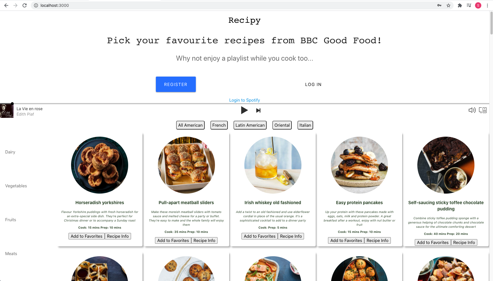
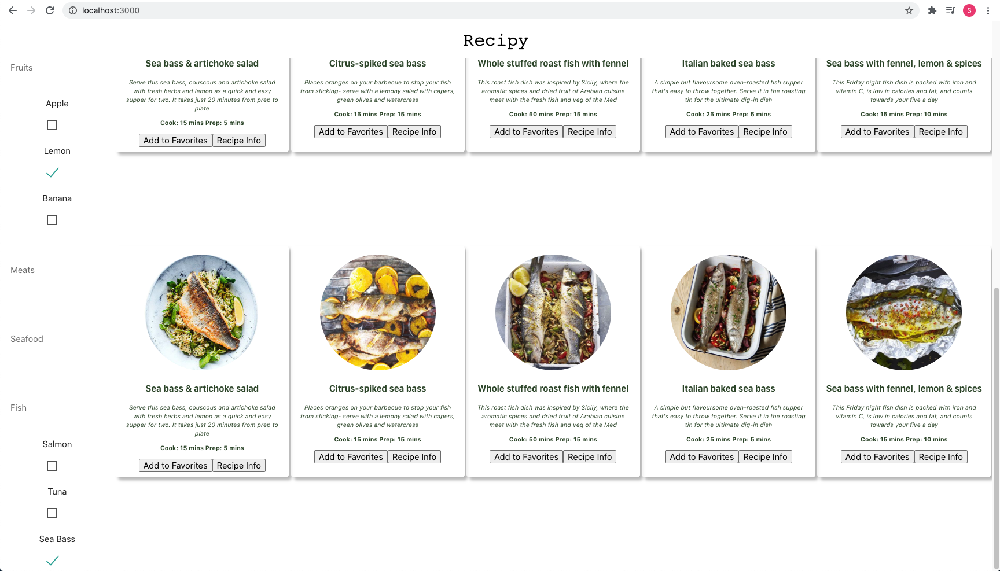

# Recipy

[](https://travis-ci.org/PiperS52/Recipy)

Homepage



Filtering recipes



## Brief

This was a final project as part of Makers Academy. As a group we decided to design a food web app which would allow a
user to select a recipe according to what they had in their cupboard, while being able to listen to a cuisine-themed playlist for some inspiration while they cook.

## User Stories

```
As a user
Because I am obsessed with BBC
I would like to have access to all recipes from BBC Food

As a user
So that I can choose what to eat tonight
I would like to see a list of recipes with titles, images, summary, cook time

As a user
So that the page loads suitably quickly
I would like to be able to scroll infinitely

As a user
So that I can see all the recipe details
I would like to click on a recipe card and see a pop-up of all recipe details (ingredients, instructions etc.)

As a user
So that I can find recipes that use ingredients I have in the cupboard
I want to be able to filter recipes by ingredients

As a user
I can listen to music with my meal
I would like to have a link to a relaxing background music playlist from Spotify
```
## Technologies used

| Technology    | Use                           |
| ------------- | ----------------------------- |
| Node          | Back-end JavaScript Framework |
| Express       | Web application framework     |
| ReactJS       | Frontend JavaScript Framework |
| Redux         | Managing application state    |
| Puppeteer     | Web Scraping                  |
| Cypress       | Front-end testing             |
| Jasmine       | Back-end testing              |
| MongoDB       | Database                      |
| CSS           | Styling                       |
| Travis        | CI/CD                         |
| Heroku        | Production Environment        |
| ESLint        | Linting                       |

---
## Getting started:

Clone this repository
```
git clone https://github.com/PiperS52/Recipy.git
```
Run the package installer with the following command in the root folder, client folder, as well as inside web-api-auth-examples:
```
npm install
```
Run the web app from the root folder:
```
npm run dev
```
The browser should then open the project url in your browser automatically at http://localhost:3000

## To run tests:

```
npm test
```
## Additional resources:

- Recipe Scraper - https://github.com/PiperS52/scraper

## Contributions

Many thanks to the rest of the Recipy team:<br/>
[Lisa Bardelli](https://github.com/lisabardelli), [Zeen Lam](https://github.com/ZeenLamDev),
[AJ Montgomery](https://github.com/AJSMonty), and [Will Helliwell](https://github.com/Will-Helliwell)
